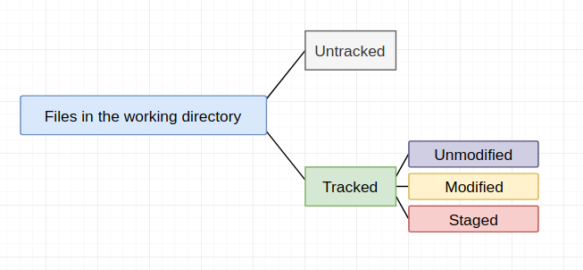

# Chapter2 Git Basics

## 2.1 Getting a Git Repository 
````bash
git init # initialize a git repository from a local directory.
git clone <url> # clone* an existing git repository from elsewhere.
git clone <url> <newname> # clone an existing git repository and rename it.
````
\* Pulls down all the data for that repository, and checks out a working copy of the latest version.

## 2.2 Recording Changes to the Repository 
<p align="center"></p>
<p align="center">Figure 1. File state in the working directory.</p>

<p align="center"></p>
<p align="center">Figure 2. The lifecycle of the status of the files.</p>

### status
````bash
git status # show the working tree status
git stats --short # show the working tree status in a more compact way
````
### add
`git add` add precisely this content to the next commit.

````bash
git add <filename> # *add file contents to the index
git add -A # add all modified and untracked files to the index
````
\* The index is a binary file (generally kept in `.git/index`) containing a sorted list of path names, each with permissions and the SHA1 of a blob object; `git ls-files` can show you the contents of the index. Please note that words index, stage, and cache are the same thing in Git: they are used interchangeably.

### ignoring files
`.gitignore` ignore specific files that git will not try to track them.

> The rules for the patterns you can put in the .gitignore file are as follows:
> - Blank lines or lines starting with # are ignored.
> 
> - Standard glob patterns work, and will be applied recursively throughout the entire working tree.
> 
> - You can start patterns with a forward slash (/) to avoid recursivity.
> 
> - You can end patterns with a forward slash (/) to specify a directory.
> 
> - You can negate a pattern by starting it with an exclamation point (!).

### diff
`git diff` Show changes between commits, commit and working tree, etc.
````bash
git diff # to see what you've changed but not staged (compare working directory with staging area)
git diff --staged # *compare staging area and the last commit
git diff master # compare working directory and the last commit from the master branch
````
**Note:** `git diff --staged` == `git diff --cached`

### commit
`git commit` Record changes to the repository.

````bash
git commit -m "commit message" # commit with single line commit message
git commit # call core.editor and input multi-lines commit message
git commit -v # show the changes when edit the commit message
git commit -m "Skip git add part" -a # directly git commit
````
!> `git commit -a` can not add `untracked` file automatically. In this situation, you need to use `git add` manually.

### rm
````bash
git rm <filename> == git add <filename> # add deleted file to the index
git rm --cached <filename> # remove the file from the staging area
````

### mv
````bash
git mv file_from file_to

# equivalent to running something like this:

mv README.md README
git rm README.md
git add README
````

## 2.3 Viewing the Commit History 
### log
````bash
git log # lists the commits in reverse chronological order
git log -p/--patch # show the patch output
git log -n # limit the number of log entries displayed
git log --stat # show abbreviated stats for each commit
git log --pretty=oneline # prints each commit on a single line
git log --pretty=format:"%H %cn %cd %s" # prints the formatted log
git log --pretty=format:"%h %cn %s" --graph # display an ASCII graph
git log --author='lolimay' # query logs by specifying author
git log --since='2019-04-21' # query logs by specifying start time
git log --before='2019-04-22' # query logs by specifying end time
git log --no-merges # prevent the display of merge commits
````

## 2.4 Undoing Things 
### redo the last commit
````bash
git commit --amend # redo the last commit
````
### unstaging a staged file
````bash
git reset (HEAD <file>) # reset staging area to the HEAD commit
````
### unmodifying a modified file
````bash
git checkout -- <file> # discard changes in working directory
git checkout . # reset working directory from the staging area
````
**Note:** `git checkout .` must be executed in the root directory of your project.

## 2.5 Working with Remotes 
### clone
````bash
git clone <url> # clone an existing git repository from elsewhere.
````
### showing your remotes
````bash
git remote # show all remote repositories
git remote -v # show all remote repositories with urls
git remote add <shortname> <url> # add remote repository
git fetch <remote> # fetch remote repository
git pull <remote> # == git fetch + git merge
git push (<remote> <branch>)

````
### inspecting a remote
````
git remote show origin # show information about origin
````
### renaming and removing remotes
````bash
git remote rename <oldname> <newname> # rename remote repository
git remete remove <remote> # remove remote repository
````

### modify remotes
````bash
git remote set-url <name> <newurl> # set new url for the existing remote
````

## 2.6 Tagging 
### listing your tags
````bash
git tag # lists all tags in alphabetical order
git tag -l "v1.8.5*" # search for tags that match a particular pattern
````
### creating tags
````bash
git tag -a v1.1 -m "version 1.1" # annotated tag
git tag v1.1-lw # lightweight tag
git tag -a v1.2 -m "version 1.2" 9fceb02 # tagging later
````

### show tag
````bash
git show v1.0
````

### sharing tags
**Note:** By default, the `git push` command doesn’t transfer tags to remote servers. 
````bash
git push origin <tagname> # push specific tag
git push [<remote>] --tags # push all tags
````

### deleting tags
````bash
git tag -d <tagname> # delete local tag
# Two ways of deleting remote tags
git push <remote> :refs/tags/<tagname>
git push <remote> --delete <tagname>
````

### checking out tags
````bash
git checkout v1.0 # switch to this tag
git checkout -b <branchname> <tagname>/<commitid> # create a new branch
````

## 2.7 Git Aliases 
````bash
git config --global alias.co checkout # set alias
git config --global alias.visual '!gitk' # alias to run an external command
````
**Note:** A much more recommended way that set git alias is to edit [~/.gitconfig](~/.gitconfig) file directly. And below is the template:
````ini
[user]
	email = lolimay@lolimay.cn
	name = lolimay
[http]
	postBuffer = 524288000
	postBuffer = 524288000
[core]
	editor = vim
[alias]
	lo = log --graph --abbrev-commit --decorate --format=format:'%C(bold cyan)%h%C(reset) - %C(bold green)(%ar)%C(reset) %C(white)%s%C(reset) %C(dim white)- %an%C(reset)%C(bold yellow)%d%C(reset)' --all
	visual = !gitk
````

## Reference
1. [Git: Understanding the Index File](https://mincong-h.github.io/2018/04/28/git-index/)
2. [Good .gitignore file examples](https://github.com/github/gitignore)


[Home](/) | [Previous](./1-Getting-Started.md) | [Next](./3-Git-Branching.md)
